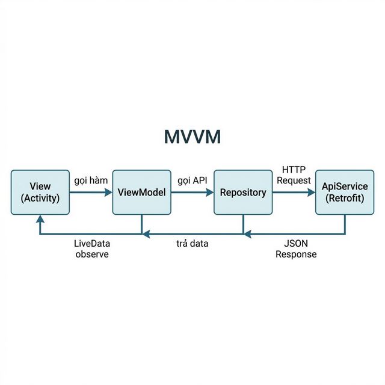
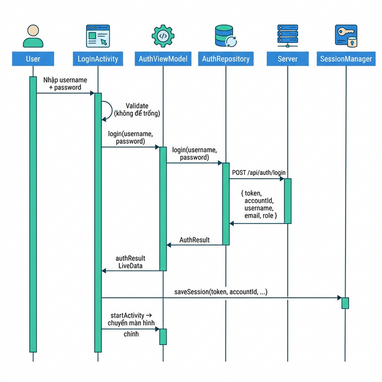
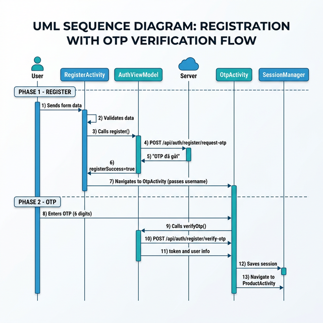
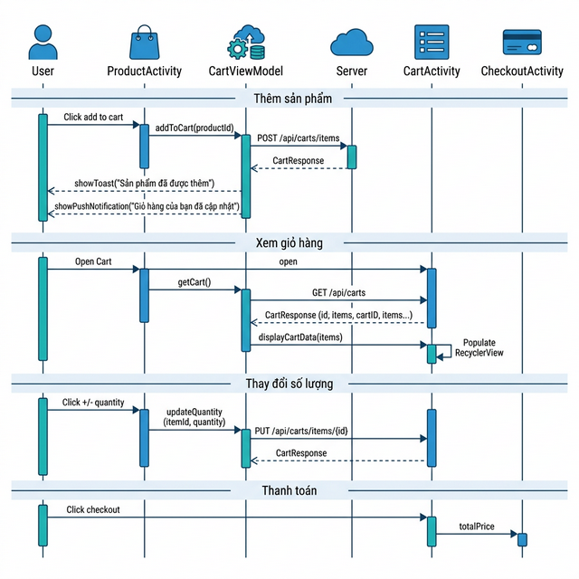

# Tài Liệu: Luồng Authentication & Product Cart

> Ứng dụng **Qua-Tet-Mobile** — Android Native (Kotlin)

---

## Mục lục
1. [Kiến trúc tổng quan](#1-kiến-trúc-tổng-quan)
2. [Luồng Authentication (Đăng ký / Đăng nhập)](#2-luồng-authentication)
3. [Luồng Product Cart (Giỏ hàng)](#3-luồng-product-cart)
4. [Công nghệ sử dụng](#4-công-nghệ-sử-dụng)

---

## 1. Kiến trúc tổng quan

Cả hai luồng đều tuân theo kiến trúc **MVVM (Model – View – ViewModel)**:



| Tầng | Vai trò | Ví dụ file |
|------|---------|------------|
| **View** | Hiển thị UI, nhận input từ người dùng | `LoginActivity.kt`, `CartActivity.kt` |
| **ViewModel** | Xử lý logic, giữ trạng thái UI | `AuthViewModel.kt`, `CartViewModel.kt` |
| **Repository** | Trung gian giữa ViewModel và API | `AuthRepository.kt`, `CartRepository.kt` |
| **ApiService** | Định nghĩa các endpoint REST API | `AuthApiService.kt`, `CartApiService.kt` |
| **DTO (Model)** | Các data class cho request/response | `AuthDTO.kt`, `CartDTO.kt` |

### Hạ tầng chung

| File | Chức năng |
|------|-----------|
| [RetrofitClient.kt](file:///c:/Mobile/Qua-Tet-Mobile/app/src/main/java/com/semester7/quatet/data/remote/RetrofitClient.kt) | Singleton khởi tạo Retrofit với `BASE_URL = http://14.225.207.221:5000`, cài đặt JSON converter, logging interceptor |
| [BaseResponse.kt](file:///c:/Mobile/Qua-Tet-Mobile/app/src/main/java/com/semester7/quatet/data/model/BaseResponse.kt) | Wrapper chung cho mọi response từ server: `{ status, msg, data }` |
| [AuthInterceptor.kt](file:///c:/Mobile/Qua-Tet-Mobile/app/src/main/java/com/semester7/quatet/data/remote/AuthInterceptor.kt) | Tự động gắn `Bearer token` vào header mọi request nếu user đã đăng nhập |
| [SessionManager.kt](file:///c:/Mobile/Qua-Tet-Mobile/app/src/main/java/com/semester7/quatet/data/local/SessionManager.kt) | Lưu/đọc/xóa session (token, accountId, username, email, role) bằng SharedPreferences |

---

## 2. Luồng Authentication

### 2.1 Các file liên quan

| File | Vai trò |
|------|---------|
| [AuthDTO.kt](file:///c:/Mobile/Qua-Tet-Mobile/app/src/main/java/com/semester7/quatet/data/model/AuthDTO.kt) | Định nghĩa request/response: `LoginRequest`, `RegisterRequest`, `VerifyOtpRequest`, `AuthResult`, `ErrorResponse` |
| [AuthApiService.kt](file:///c:/Mobile/Qua-Tet-Mobile/app/src/main/java/com/semester7/quatet/data/remote/AuthApiService.kt) | 3 endpoint: `POST login`, `POST register/request-otp`, `POST register/verify-otp` |
| [AuthRepository.kt](file:///c:/Mobile/Qua-Tet-Mobile/app/src/main/java/com/semester7/quatet/data/repository/AuthRepository.kt) | Gọi API và trả về `data` từ `BaseResponse` |
| [AuthViewModel.kt](file:///c:/Mobile/Qua-Tet-Mobile/app/src/main/java/com/semester7/quatet/viewmodel/AuthViewModel.kt) | Xử lý logic login/register/verifyOtp, parse lỗi, cập nhật LiveData |
| [LoginActivity.kt](file:///c:/Mobile/Qua-Tet-Mobile/app/src/main/java/com/semester7/quatet/ui/activities/LoginActivity.kt) | Màn hình đăng nhập |
| [RegisterActivity.kt](file:///c:/Mobile/Qua-Tet-Mobile/app/src/main/java/com/semester7/quatet/ui/activities/RegisterActivity.kt) | Màn hình đăng ký |
| [OtpActivity.kt](file:///c:/Mobile/Qua-Tet-Mobile/app/src/main/java/com/semester7/quatet/ui/activities/OtpActivity.kt) | Màn hình nhập OTP xác thực |
| [SessionManager.kt](file:///c:/Mobile/Qua-Tet-Mobile/app/src/main/java/com/semester7/quatet/data/local/SessionManager.kt) | Lưu trữ phiên đăng nhập |
| [AuthInterceptor.kt](file:///c:/Mobile/Qua-Tet-Mobile/app/src/main/java/com/semester7/quatet/data/remote/AuthInterceptor.kt) | Tự động gắn token vào mọi request |

### 2.2 Luồng Đăng nhập (Login)



**Nghiệp vụ chi tiết:**

1. **Mở app** → `LoginActivity` kiểm tra `SessionManager.isLoggedIn()`. Nếu đã đăng nhập → **bỏ qua login**, chuyển thẳng `ProductActivity`.
2. User nhập **username** và **password**, nhấn nút **Đăng nhập**.
3. `LoginActivity` validate input (không được để trống).
4. Gọi `AuthViewModel.login()` → chạy coroutine, gọi API `POST /api/auth/login`.
5. Server trả về `AuthResult` chứa **JWT token** + thông tin user.
6. `LoginActivity` observe `authResult` LiveData → lưu session vào **SharedPreferences** qua `SessionManager.saveSession()`.
7. Chuyển sang `ProductActivity`, kết thúc `LoginActivity`.

> [!NOTE]
> Nếu API trả lỗi (sai mật khẩu, tài khoản không tồn tại...), `AuthViewModel` parse body lỗi JSON từ server (`ErrorResponse`) và đẩy message vào `errorMessage` LiveData để hiển thị trên UI.

### 2.3 Luồng Đăng ký (Register + OTP)



**Nghiệp vụ chi tiết:**

1. User nhấn "Đăng ký" trên `LoginActivity` → mở `RegisterActivity`.
2. Nhập **bắt buộc**: `username`, `password` (≥ 6 ký tự), `email`. **Tùy chọn**: `fullname`, `phone`.
3. Gọi `POST /api/auth/register/request-otp` → Server gửi **mã OTP qua email**.
4. Đăng ký thành công → chuyển sang `OtpActivity`, truyền `username` qua Intent Extra.
5. User nhập **mã OTP 6 số** nhận được từ email.
6. Gọi `POST /api/auth/register/verify-otp` → Server xác thực OTP, trả về **JWT token + thông tin user**.
7. Lưu session → chuyển về `ProductActivity`, xóa `LoginActivity` khỏi back stack bằng `FLAG_ACTIVITY_CLEAR_TOP`.

### 2.4 Quản lý phiên (Session Management)

`SessionManager` là **singleton object** sử dụng **SharedPreferences** để lưu trữ:

| Key | Kiểu dữ liệu | Mô tả |
|-----|---------------|-------|
| `token` | String | JWT token dùng xác thực API |
| `accountId` | Int | ID tài khoản |
| `username` | String | Tên đăng nhập |
| `email` | String? | Email (nullable) |
| `role` | String? | Vai trò: user/admin (nullable) |

**Cơ chế tự động gắn token:**
`AuthInterceptor` (OkHttp Interceptor) tự động đọc token từ `SessionManager` và gắn vào header `Authorization: Bearer <token>` cho **mọi HTTP request**. Nếu chưa đăng nhập (token = null) → gửi request bình thường không có header.

**Đăng xuất:** Gọi `SessionManager.clearSession()` → xóa toàn bộ SharedPreferences.

---

## 3. Luồng Product Cart

### 3.1 Các file liên quan

| File | Vai trò |
|------|---------|
| [CartDTO.kt](file:///c:/Mobile/Qua-Tet-Mobile/app/src/main/java/com/semester7/quatet/data/model/CartDTO.kt) | Định nghĩa: `AddToCartRequest`, `UpdateCartItemRequest`, `CartItemResponse`, `CartResponse`, `CartCountResponse` |
| [CartApiService.kt](file:///c:/Mobile/Qua-Tet-Mobile/app/src/main/java/com/semester7/quatet/data/remote/CartApiService.kt) | 6 endpoint: GET cart, GET count, POST add, PUT update, DELETE remove, DELETE clear |
| [CartRepository.kt](file:///c:/Mobile/Qua-Tet-Mobile/app/src/main/java/com/semester7/quatet/data/repository/CartRepository.kt) | Trung gian gọi API cart |
| [CartViewModel.kt](file:///c:/Mobile/Qua-Tet-Mobile/app/src/main/java/com/semester7/quatet/viewmodel/CartViewModel.kt) | Xử lý logic CRUD giỏ hàng, quản lý trạng thái loading/error/success |
| [CartActivity.kt](file:///c:/Mobile/Qua-Tet-Mobile/app/src/main/java/com/semester7/quatet/ui/activities/CartActivity.kt) | Màn hình giỏ hàng, hiển thị danh sách + tổng tiền + nút thanh toán |
| [CartAdapter.kt](file:///c:/Mobile/Qua-Tet-Mobile/app/src/main/java/com/semester7/quatet/ui/adapters/CartAdapter.kt) | RecyclerView Adapter hiển thị từng sản phẩm trong giỏ |
| [NotificationHelper.kt](file:///c:/Mobile/Qua-Tet-Mobile/app/src/main/java/com/semester7/quatet/utils/NotificationHelper.kt) | Push notification + badge count khi thêm sản phẩm |

### 3.2 Cấu trúc dữ liệu giỏ hàng

```
CartResponse (Giỏ hàng tổng thể)
├── cartId: Int
├── accountId: Int (liên kết với user đang đăng nhập)
├── items: List<CartItemResponse>
│   ├── cartDetailId: Int (ID dòng chi tiết)
│   ├── productId, productName, sku
│   ├── price: Double (giá đơn vị)
│   ├── quantity: Int
│   ├── subTotal: Double (= price × quantity)
│   └── imageUrl: String?
├── totalPrice: Double (tổng trước giảm)
├── discountValue: Double? (giá trị giảm giá)
├── finalPrice: Double (tổng sau giảm)
├── itemCount: Int (tổng số loại sản phẩm)
└── promotionCode: String? (mã khuyến mãi nếu có)
```

### 3.3 Các API endpoint

| Method | Endpoint | Chức năng | Request Body | Response |
|--------|----------|-----------|--------------|----------|
| `GET` | `/api/carts` | Lấy toàn bộ giỏ hàng | — | `CartResponse` |
| `GET` | `/api/carts/count` | Đếm số sản phẩm | — | `CartCountResponse` |
| `POST` | `/api/carts/items` | Thêm sản phẩm vào giỏ | `{ productId, quantity }` | `CartResponse` |
| `PUT` | `/api/carts/items/{cartDetailId}` | Cập nhật số lượng | `{ quantity }` | `CartResponse` |
| `DELETE` | `/api/carts/items/{cartDetailId}` | Xóa 1 sản phẩm | — | `CartResponse` |
| `DELETE` | `/api/carts/clear` | Xóa toàn bộ giỏ | — | `MessageResponse` |

> [!IMPORTANT]
> Tất cả API cart đều yêu cầu **JWT token** trong header. Server dựa vào token để biết giỏ hàng thuộc user nào. Token được `AuthInterceptor` tự động gắn.

### 3.4 Luồng nghiệp vụ chính



**Nghiệp vụ chi tiết:**

#### a) Thêm sản phẩm vào giỏ
1. Từ màn hình sản phẩm, user nhấn nút thêm giỏ hàng.
2. `CartViewModel.addItem(productId, quantity=1)` → `POST /api/carts/items`.
3. Thành công → hiển thị **Toast** ("Thêm vào giỏ thành công") + **Push Notification** với badge count trên icon app.

#### b) Xem giỏ hàng
1. Mở `CartActivity` → gọi `fetchCart()` ngay trong `onCreate`.
2. Hiển thị danh sách sản phẩm qua `RecyclerView` + `CartAdapter`.
3. Mỗi item hiển thị: **ảnh** (load bằng Coil), **tên**, **giá đơn vị**, **số lượng** (+/- buttons), **subtotal**.
4. Footer hiển thị: **tổng số sản phẩm** + **tổng tiền** (format VNĐ) + nút **Thanh toán**.
5. Nếu giỏ trống → ẩn danh sách, hiện layout "Giỏ hàng trống".

#### c) Tăng/Giảm số lượng
- **Tăng (+):** Gọi `updateItem(cartDetailId, currentQty + 1)`.
- **Giảm (-):** Nếu quantity > 1 → giảm. Nếu quantity = 1 → hiện **dialog xác nhận xóa**.

#### d) Xóa sản phẩm
- Xóa 1 item → `DELETE /api/carts/items/{cartDetailId}` (hiện dialog xác nhận trước).
- Xóa toàn bộ giỏ → `DELETE /api/carts/clear` (hiện dialog xác nhận trước).

#### e) Thanh toán
- Nhấn "Thanh toán" → kiểm tra `totalPrice > 0`, nếu có → chuyển sang `CheckoutActivity`, truyền `totalPrice` qua Intent Extra.

### 3.5 Notification & Badge

[NotificationHelper.kt](file:///c:/Mobile/Qua-Tet-Mobile/app/src/main/java/com/semester7/quatet/utils/NotificationHelper.kt) xử lý:

1. **Notification Channel** (Android 8.0+): Tạo channel `"cart_notification_channel"` cho thông báo giỏ hàng.
2. **Push Notification**: Khi thêm sản phẩm → bắn notification trên thanh trạng thái.
3. **Badge Count**: Dùng thư viện **ShortcutBadger** để hiển thị số trên icon app (ví dụ: con số 3 trên icon app khi có 3 sản phẩm).
4. **Xóa badge**: Khi giỏ hàng trống → gọi `clearBadge()`.

---

## 4. Công nghệ sử dụng

### 4.1 Ngôn ngữ & Nền tảng

| Công nghệ | Mô tả |
|------------|-------|
| **Kotlin** | Ngôn ngữ chính, sử dụng các tính năng: `data class`, `coroutines`, `extension functions`, `nullable types` |
| **Android SDK** | `minSdk = 24` (Android 7.0), `targetSdk = 36` |

### 4.2 Kiến trúc & UI

| Công nghệ | Mô tả | Dùng trong |
|------------|-------|------------|
| **MVVM** | Tách biệt View ↔ Logic ↔ Data. ViewModel giữ trạng thái, View chỉ observe | Cả 2 luồng |
| **View Binding** | Truy cập view từ XML layout mà không cần `findViewById()`, type-safe | Tất cả Activity |
| **LiveData** | Observable data holder, tự cập nhật UI khi data thay đổi, lifecycle-aware | ViewModel → Activity |
| **RecyclerView** | Hiển thị danh sách có thể scroll, tái sử dụng view để tối ưu bộ nhớ | `CartAdapter` |

### 4.3 Networking (Giao tiếp API)

| Công nghệ | Phiên bản | Mô tả |
|------------|-----------|-------|
| **Retrofit** | 2.x | HTTP client cho Android, định nghĩa API bằng interface + annotation (`@GET`, `@POST`, `@PUT`, `@DELETE`) |
| **OkHttp** | (đi kèm Retrofit) | HTTP engine thực tế, hỗ trợ interceptor, logging |
| **OkHttp Logging Interceptor** | — | Log toàn bộ request/response trong Logcat (chế độ `BODY`) để debug |
| **Kotlinx Serialization** | — | Parse JSON ↔ Kotlin data class, nhanh hơn Gson, hỗ trợ nullable, default values |
| **AuthInterceptor** (custom) | — | OkHttp Interceptor tự viết: tự động gắn `Authorization: Bearer <token>` vào mọi request |

### 4.4 Lưu trữ cục bộ

| Công nghệ | Mô tả |
|------------|-------|
| **SharedPreferences** | Key-value store trong Android, dùng lưu session (token, user info). Dữ liệu tồn tại khi đóng app, mất khi gỡ app |

### 4.5 Thư viện bổ trợ

| Thư viện | Mô tả | Dùng trong |
|----------|-------|------------|
| **Coil** | Thư viện load ảnh cho Android (nhẹ, viết bằng Kotlin, hỗ trợ coroutines). Dùng để load ảnh sản phẩm từ URL | `CartAdapter` |
| **ShortcutBadger** `1.1.22` | Hiển thị badge count (con số) trên icon app ở launcher | `NotificationHelper` |
| **Kotlin Coroutines** | Xử lý bất đồng bộ (async), tránh block main thread khi gọi API | ViewModel `viewModelScope.launch {}` |

### 4.6 Tổng kết công nghệ theo luồng

| Luồng | Công nghệ |
|-------|-----------|
| **Authentication** | Retrofit + OkHttp + Kotlinx Serialization + SharedPreferences + AuthInterceptor + Coroutines + MVVM + LiveData + View Binding |
| **Product Cart** | Retrofit + OkHttp + Kotlinx Serialization + Coroutines + MVVM + LiveData + View Binding + RecyclerView + Coil + ShortcutBadger + NotificationCompat |

---

> [!TIP]
> Để debug API, mở **Logcat** trong Android Studio và filter bằng tag `AUTH_DEBUG` (cho luồng Auth) hoặc `CART_DEBUG` / `CART_VM` (cho luồng Cart) để xem log request/response.
